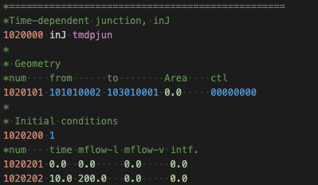

# Official Syntax Highlighter for RELAP5-3D input files

Syntax highlighting for [RELAP5-3D](https://relap53d.inl.gov/SitePages/Home.aspx) in [Visual Studio Code](https://code.visualstudio.com/).

Original Creator: Paolo Balestra
Current Owner: Jan Vermaak

INL LRS number: INL/MIS-24-78549 Rev:000

## Example syntax

## Add more language features

* To add features such as IntelliSense, hovers and validators check out the VS Code extenders documentation at https://code.visualstudio.com/docs

## Features
`Coming soon.`

---

